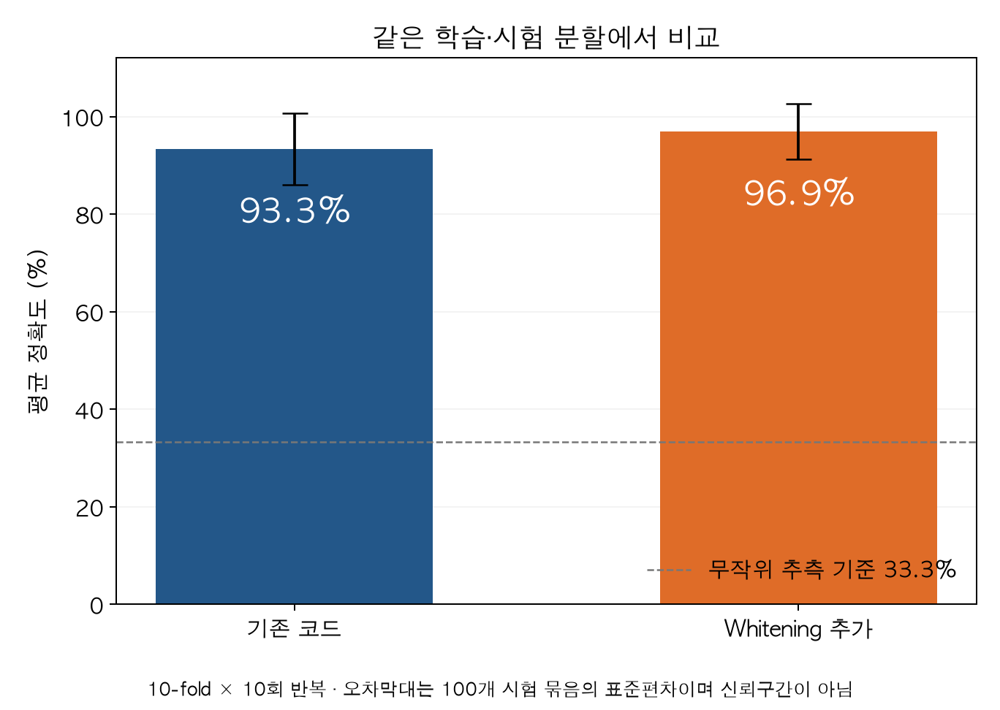
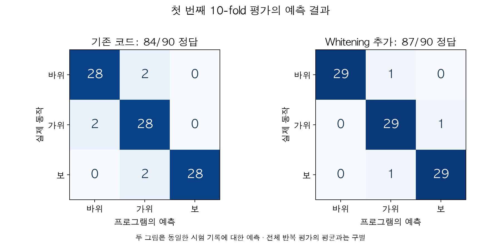
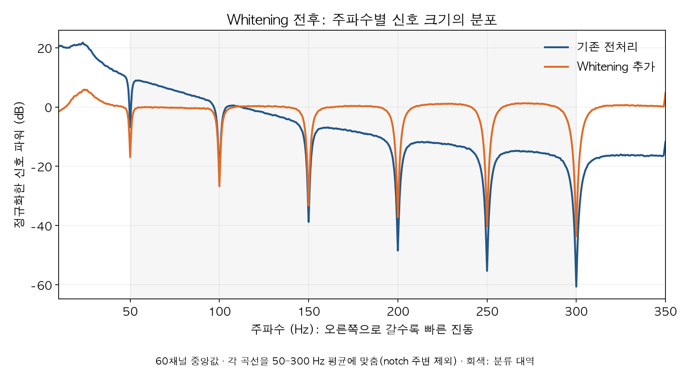

# Whitening 비교 결과

실행일: 2026-10-05, 작업 폴더: `/Users/hhlee/hackathon_project`

기존 프로그램의 평균 정확도 93.3%를 재현한 뒤, whitening을 추가한 결과 **96.9%**를 얻었다. 같은 자료와 학습·시험 분할에서 **3.56%p** 높아졌다. 지금까지 hhlee가 맡은 작업은 기존 프로그램에 whitening을 추가하고 그 효과를 비교한 것이다.

## 결과

| 검사 | 기존 코드 | Whitening 추가 |
| --- | --- | --- |
| 세 동작 정확도 | 93.3% ± 7.4% | **96.9% ± 5.7%** |
| 바위·가위 정확도 | 93.5% ± 9.4% | 96.7% ± 7.1% |
| 정답을 섞은 대조 검사, 20회 평균 | 33.8% | 33.3% |

분류 정확도는 10-fold를 10회 반복한 100개 시험 묶음의 평균과 표준편차다. 표준편차는 신뢰구간이 아니다. 세 동작의 무작위 추측 기준은 33.3%, 바위·가위 두 동작은 50%다.



첫 번째 10-fold 검사에서는 기존 방법이 **84/90**, whitening 추가 방법이 **87/90**을 맞혔다. 각 동작은 28/30에서 29/30으로 바뀌었다. 기존 오답 4개를 고쳤지만 새 오답 1개도 생겨, 정답 수가 총 3개 늘었다. 이 한 차례 결과를 전체 반복 평균 96.9%와 구별해야 한다.



## 무엇을 바꿨나

기존 처리 순서는 CAR, 1 Hz high-pass, 50 Hz와 고조파 notch, 50–300 Hz bandpass, log power 특징, shrinkage LDA다.

**Notch 뒤, bandpass 앞에 채널별 AR(10) spectral whitening만 추가했다.** 각 채널의 Yule-Walker 방정식을 풀어 예측 오차 FIR 필터를 만들고, 신호에 한 번 적용했다. 현재 시점과 이전 10개 시점이 사용하는 필터 계수는 총 11개다. 적용 단계에서 추가적인 채널 표준화나 다른 분류기를 도입하지 않았다.

유지한 조건은 다음과 같다.

- ECoG 60채널, 동작 90회, 각 동작 30회.
- 동작 지시 후 0.25–2.25초, 0.25초 구간 8개.
- 60채널 × 8구간 = 특징 480개, 채널 우선 배열 순서.
- `LinearDiscriminantAnalysis(solver="lsqr", shrinkage="auto")`.
- `RepeatedStratifiedKFold(n_splits=10, n_repeats=10, random_state=0)`.
- 각 시험 묶음의 학습 81개·시험 9개. 두 방법이 동일한 인덱스를 사용한다.
- 기존과 같은 20개 정답 섞기 및 각 반복의 10-fold 분할 규칙.

기존 조건의 특징 행렬을 다시 계산했을 때 저장된 원본 실행 결과와의 최대 차이는 **0.0**이었다. 100개 시험 묶음의 기존 정확도와 첫 반복 예측도 정확히 일치했다. 바위·가위 및 정답 섞기 검사의 기존 기준값은 이미 검증한 원본 실행 기록을 사용했다.

## 필터 설정과 시험 자료의 관계

Whitening 필터는 첫 동작 지시 전의 자료로만 맞췄다. 최초 동작 지시는 12.08초에 시작한다.

1. 원신호의 0–12.08초 부분을 나머지 기록과 분리해 기존 전처리를 적용했다.
2. 경계 영향을 줄이기 위해 양끝 2초를 제외했다.
3. **2.00–10.08초, 채널당 9,696개 샘플**에서 채널별 평균을 뺀 biased 자기공분산으로 AR 계수를 추정했다.
4. 계수를 고정한 뒤 전체 기록의 notch 처리 뒤에 적용했다.

따라서 손동작 90회의 자료나 정답은 whitening 계수 추정에 사용하지 않았다. 초기 보정 구간, AR 차수, 특징 구간, 검사 시드는 결과를 보기 전에 정했다. 정확도를 높이려고 여러 설정을 탐색한 실험은 아니다.

이 보정 구간 선택은 이번 구현의 결정이다. 공유 논문은 AR 기반 spectral whitening을 설명하지만, 이번의 구체적인 2.00–10.08초 구간을 지정하지는 않는다.

## 신호 그림 읽기



가로축은 주파수다. 오른쪽으로 갈수록 빠른 진동 성분을 뜻한다. 세로축은 정규화한 파워이고, 전극 60개의 중앙값을 그렸다.

파란색은 기존 전처리 후, 주황색은 whitening 추가 후다. 주황색 곡선이 더 평평해져 주파수별 크기의 쏠림이 줄었다. 50, 100, 150 Hz 등에 있는 골짜기는 notch 처리의 흔적이다.

분포 모양을 비교하려고 각 조건을 자기 자신의 50–300 Hz 평균 파워에 맞췄다. 이 평균 계산과 평탄도 계산에서는 notch 중심 주변 ±3 Hz를 제외했다. 따라서 두 곡선의 높이 차이를 절대적인 전위나 파워 증가로 해석하지 않는다.

같은 대역에서 전극별 spectral flatness의 중앙값은 **0.203에서 0.962**로 바뀌었다. 이 값은 주파수별 파워 분포가 얼마나 평평한지에 대한 진단값이며, 분류 정확도와는 다른 지표다.

## 해석 범위

이 결과는 한 사람의 한 기록에 있는 90회 동작에서, 정해진 비교 조건에 따라 관찰한 개선이다. 다른 사람·다른 날의 독립적인 자료에서 평가하지 않았다. 반복 CV는 같은 기록을 재사용하므로 100개의 독립적인 실험으로 취급하거나 표준편차를 신뢰구간으로 해석하지 않는다. 통계적 유의성을 검정했다고 주장하지 않는다.

기존 코드의 양방향 high-pass·notch·bandpass 필터는 비교를 위해 유지했다. 이 실험은 오프라인 분석이며 실시간 처리의 검증은 아니다. 정답을 섞은 검사가 우연 수준이라는 것은 대조 검사 결과이지, 모든 편향이나 누수가 없다는 증명은 아니다.

Gruenwald 논문의 전체 TVLDA·특징 축소·평가 설정을 재현한 실험이 아니므로 논문이나 G55 발표의 약 99%와 수치만으로 직접 비교하지 않는다. 이번 기여는 Abri의 기존 LDA 분석에서 whitening의 효과를 분리해 확인한 것이다.

## 파일과 재실행

- `whitening_compare.py`: 전처리, whitening, 동일 분할 평가, 결과 저장을 수행한다.
- `01_baseline_whitening.ipynb`: 결과 그림과 쉬운 설명, 필요할 때 사용할 재실행 셀이 있다.
- `results/whitening/comparison_metrics.json`: 정확한 수치, 방법 설정, 라이브러리 버전, 파일 해시.
- `results/whitening/comparison_arrays.npz`: 두 조건의 특징, 정답, 학습·시험 인덱스, 예측, 필터 계수, 스펙트럼 요약.
- `TEAM_UPDATE.md`: 팀원에게 보낼 영어 메시지 초안과 한국어 번역.

```bash
/Users/hhlee/miniconda3/envs/ecog/bin/python /Users/hhlee/hackathon_project/whitening_compare.py
```

실행 위치와 무관하게 스크립트가 있는 프로젝트의 `source/ECoG_Handpose.mat`와 기존 `results/baseline_results.npz`를 읽는다. 출력은 `results/whitening/`에 저장하며, 재실행하면 같은 이름의 결과 파일을 갱신한다. 현재 환경에서는 약 45–50초 걸렸다. 기존 `source/classify.py`와 원본 자료는 수정하지 않았다.

방법 참고: [공유 논문 7쪽, spectral whitening](<source/Copy of Hand.pdf>), [SciPy의 FIR/IIR 필터 API](https://docs.scipy.org/doc/scipy/reference/generated/scipy.signal.lfilter.html), [Toeplitz 연립방정식 API](https://docs.scipy.org/doc/scipy/reference/generated/scipy.linalg.solve_toeplitz.html).
