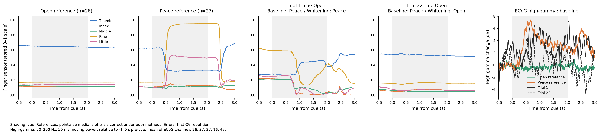
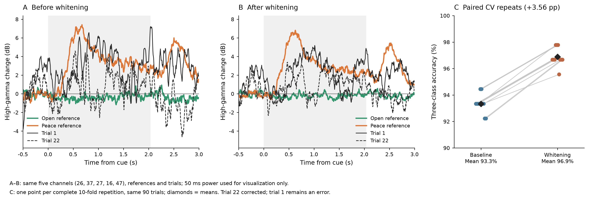
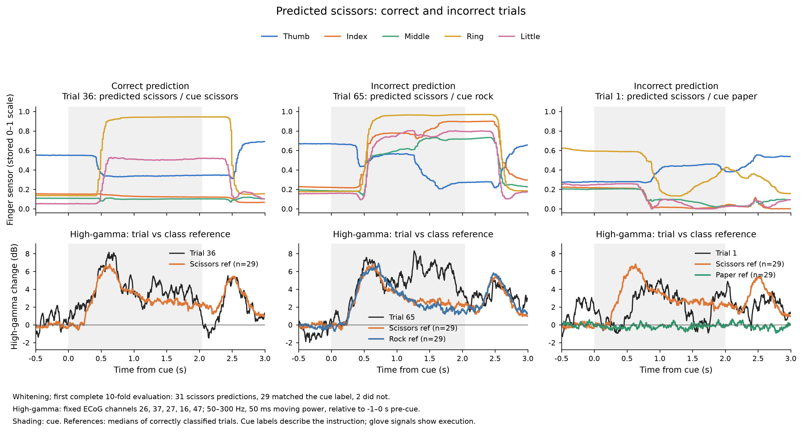
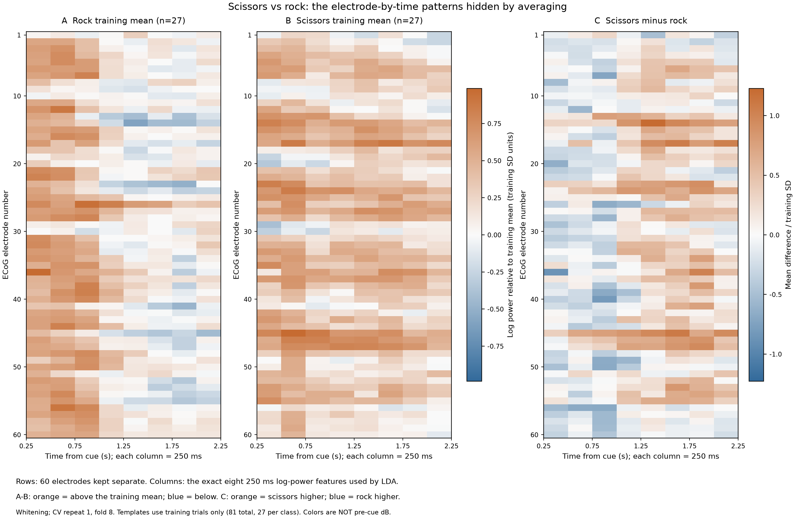
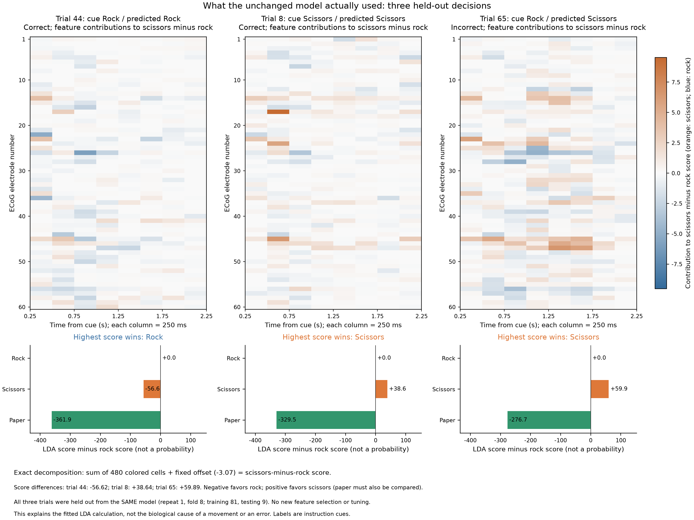

# 팀원 공유용 실제 분석 그림

이 그림은 `source/ECoG_Handpose.mat`의 손가락 센서와 ECoG, 실제 교차검증 예측값으로 만들었다. 공유하기 쉬운 영어 축·범례를 사용했고, 그림을 만든 방법과 한국어 설명을 함께 적었다.

## 공유할 파일

- `01_glove_ecog_errors.png`: 대표 손동작과 실제 오분류 두 사례, ECoG 활동.
- `02_whitening_comparison.png`: 같은 전극의 whitening 전후 활동과 반복 평가 정확도.
- `03_predicted_scissors_examples.png`: 같은 '가위' 예측이 맞은 경우와 틀린 두 경우를 비교.
- `04_channel_time_patterns.png`: 모델이 사용하는 60전극 × 8시간 구간을 펼친 바위·가위 학습 패턴과 차이.
- `05_held_out_decisions.png`: 같은 모델의 실제 바위·가위 정답 사례와 바위→가위 오답을 특징 기여도·판정 점수로 설명.
- 같은 이름의 `.svg`: 확대하거나 발표자료에서 편집할 수 있는 벡터 파일.

## 1. 손가락 센서와 뇌 활동



앞의 네 그래프는 가로축이 동작 지시로부터 지난 시간, 세로축이 파일에 저장된 손가락 센서값이다. 각 선은 엄지·검지·중지·약지·새끼손가락이다. 센서값에 추가적인 정규화는 하지 않았다. 이 값을 손가락 각도나 전위로 해석하지 않는다.

- **Open reference**: 두 방법 모두 맞힌 보 동작 28회의 시점별 중앙값.
- **Peace reference**: 두 방법 모두 맞힌 가위 동작 27회의 시점별 중앙값.
- **Trial 1**: 보 지시를 기존 방법과 whitening 방법 모두 가위로 예측했다.
- **Trial 22**: 보 지시를 기존 방법은 가위로, whitening 방법은 보로 예측했다.

1번과 22번은 첫 번째 10-fold 반복에서 기존 방법이 틀린 보 동작의 전부다. 사례를 임의로 추가하거나 유리한 사례만 제외·선택하지 않았다. 동작 번호는 시간순 trial의 1부터 시작하는 번호다.

Open·Peace 등의 정답 라벨은 **화면에 제시된 동작 지시**에서 온다. 실제로 어떤 움직임을 수행했는지는 손가락 센서로 따로 관찰해야 하므로, 그림 제목에는 `cue Open`이라고 표시했다.

마지막 그래프는 원래의 뇌 전위 대신 **50–300 Hz high-gamma 파워의 변화**를 보여준다. 각 동작 지시 전 1초를 기준으로 변화를 dB로 표시했다. 회색 음영은 동작 지시가 표시된 구간이다.

### English caption

Glove trajectories and high-gamma activity for Open and Peace references and the two baseline Open-to-Peace errors in the first CV repetition. References are pointwise medians of trials classified correctly by both methods (Open: n=28; Peace: n=27). The actual sensor traces are shown for trials 1 and 22. Whitening corrected trial 22, while trial 1 remained misclassified. Shading indicates the cue interval.

### 한국어 번역

첫 번째 교차검증 반복에서 보·가위의 기준 손동작과, 기존 방법이 보를 가위로 잘못 분류한 두 사례의 손가락 센서 및 high-gamma 활동을 비교했습니다. 기준 곡선은 두 방법 모두 맞힌 동작의 시점별 중앙값입니다(보 28회, 가위 27회). 1번과 22번은 실제 센서 기록을 그렸습니다. Whitening은 22번의 오분류를 바로잡았지만, 1번은 여전히 틀렸습니다. 회색 음영은 동작 지시 구간입니다.

## 2. Whitening 전후와 정확도



- **A, Before whitening**: 기존 처리 후 high-gamma 활동.
- **B, After whitening**: whitening 추가 후 활동. A와 같은 전극·동작·기준 집합·세로축 범위를 사용했다.
- **C, Paired CV repeats**: 각 점은 10-fold 전체 평가 한 번의 정확도다. 같은 분할의 결과를 선으로 연결했고, 검은 마름모는 10회 반복의 평균이다.

세 동작 평균 정확도는 **93.3% → 96.9%, +3.56%p**였다. 같은 자료를 반복 사용한 평가이므로 점 10개를 독립적인 실험 10개로 해석하지 않는다. 그림의 곡선만으로 오분류가 발생하거나 수정된 원인을 확정하지 않는다.

### English caption

High-gamma time courses before and after AR(10) whitening, using identical channels, reference trials, example trials, and y-axis limits. The right panel connects the paired accuracies from ten complete 10-fold CV repetitions; diamonds show the means. Accuracy increased from 93.3% to 96.9% (+3.56 percentage points). These are repeated evaluations of one recording, not independent recording-level replications.

### 한국어 번역

같은 전극, 기준 동작, 예시 동작과 세로축 범위를 사용해 AR(10) whitening 전후의 high-gamma 시간 곡선을 비교했습니다. 오른쪽 패널은 10-fold 전체 평가를 10회 반복한 결과를 같은 분할끼리 연결한 것으로, 마름모는 평균입니다. 정확도는 93.3%에서 96.9%로 3.56%p 높아졌습니다. 한 기록을 반복 평가한 결과이며, 서로 독립적인 기록에서 반복 검증한 결과는 아닙니다.

## 뇌신호 곡선을 만든 방법

1. 기존 코드와 같은 CAR, 1 Hz high-pass, 50 Hz 및 고조파 notch를 사용했다.
2. Whitening 조건에는 이전 비교에서 저장한 채널별 AR(10) 필터를 적용했다.
3. 50–300 Hz bandpass 후 신호를 제곱하고 50 ms 이동 평균으로 파워를 계산했다.
4. 로그 파워를 계산하고, 각 채널·동작의 지시 전 1초 평균을 빼서 상대적인 dB 변화를 구했다.
5. 기존 조건에서 동작 지시 후 0.5–2.5초 평균 반응이 가장 큰 다섯 전극을 표시용으로 선택했다: **ECoG 26, 37, 27, 16, 47번**. 전극 번호는 ECoG 1–60 기준이다(MAT 행 번호와는 다르다).
6. 이 다섯 전극의 dB 변화를 평균했다. Whitening 후에도 전극을 다시 고르지 않고 같은 집합을 사용했다.

50 ms 곡선과 표시용 전극 선택은 **그림을 위한 분석**이다. 분류기는 기존의 60채널 × 8개 250 ms 구간, 특징 480개를 그대로 사용했다. 표시용 전극 선택은 분류기의 특징 선택이나 재학습에 사용하지 않았다.

기준 동작과 표시용 전극은 이 기록 안에서 정한 탐색용 비교 대상이다. 다른 사람·다른 기록에서 독립적으로 검증한 결과나, 신호의 변화가 예측 개선의 원인이라는 증거로 주장하지 않는다.

## 3. 같은 '가위' 예측이 맞은 경우와 틀린 경우



Whitening 후의 첫 번째 10-fold 전체 평가에서 프로그램은 31회 '가위'를 예측했다. 동작 지시 라벨 기준으로 29회는 가위였고, 2회는 다른 동작이었다.

| 패널 | 실제 기록 | 프로그램의 예측 | 동작 지시 라벨 | 결과 |
| --- | --- | --- | --- | --- |
| 왼쪽 | 36번 | 가위 | 가위 | 맞음 |
| 가운데 | 65번 | 가위 | 바위 | 틀림 |
| 오른쪽 | 1번 | 가위 | 보 | 틀림 |

위쪽은 실제 손가락 센서 5개의 기록, 아래쪽은 같은 동작의 ECoG high-gamma 활동이다. 아래의 검은 선은 해당 동작 기록이고, 색 선은 whitening 방법이 맞힌 각 동작 29회의 중앙값이다. 이전 두 그림과 같은 전극과 신호 처리 방식을 사용했다.

36번은 정답 가위 예측 29개 중 동작 지시 후 0–2초의 손가락 센서 패턴이 중앙값에 가장 가까운 실제 기록이다. 나머지 두 패널은 틀린 가위 예측 두 개를 모두 포함했다. 대표 사례와 오류 사례의 선정 기준을 함께 저장했다.

가위·바위·보 라벨은 화면의 지시다. 실제로 그 동작을 정확히 수행했는지는 센서 기록을 함께 살펴봐야 한다. 이 그림만으로 모델의 판단 원인을 확정하지 않는다.

### English caption

Correct and incorrect scissors predictions after whitening. The first complete 10-fold evaluation produced 31 scissors predictions: 29 matched the cue label and two did not. Trial 36 is a representative correct scissors prediction; trials 65 and 1 are the two false scissors predictions, with rock and paper cues respectively. Top: recorded glove signals. Bottom: the trial's high-gamma time course (black) and class references from correctly classified trials (n=29 per class). Cue labels describe the instruction rather than independently verified hand posture.

### 한국어 번역

Whitening 후 가위 예측이 맞은 경우와 틀린 경우를 비교했습니다. 첫 번째 10-fold 전체 평가에서 가위를 31회 예측했으며, 29회는 동작 지시 라벨과 일치했고 2회는 일치하지 않았습니다. 36번은 대표적인 정답 가위 예측이고, 65번과 1번은 각각 바위·보 지시를 가위로 잘못 예측한 두 사례입니다. 위쪽은 실제 손가락 센서, 아래쪽 검은 선은 해당 기록의 high-gamma 활동이고 색 선은 맞힌 동작의 기준 곡선입니다(동작별 29회). 지시 라벨과 실제 손의 자세는 구별해서 읽습니다.

## 4. 평균 곡선 뒤에 가려진 가위·바위 구분 정보



첫 곡선 그림에서는 전극 5개를 평균해 가위·바위가 비슷하게 보였다. 실제 모델은 60개 전극을 평균하지 않고, 각 전극의 지시 후 0.25–2.25초를 250 ms 구간 8개로 나눈 로그 파워 480개를 사용한다.

- **A, Rock training mean**: 학습에 사용한 바위 27회의 특징 평균.
- **B, Scissors training mean**: 학습에 사용한 가위 27회의 특징 평균.
- **C, Scissors minus rock**: 두 평균의 차이. 주황색은 가위 쪽 파워가 더 높고, 파란색은 바위 쪽 파워가 더 높다.

행은 ECoG 1–60번, 열은 시간 구간이다. 각 특징을 해당 fold의 학습 81회 평균·표준편차 기준으로 표준화해 표시했다. A·B는 같은 색상 척도를 사용하며, C의 차이 척도는 별도다. 색은 원래 신호의 전위나 동작 전 대비 dB가 아니다. 표시용 표준화는 모델에 새로 적용하지 않았다.

65번 오분류가 포함된 첫 번째 CV 반복의 8번 fold를 고정했다. 테스트 9회는 학습 기준과 템플릿 계산에서 제외했다. 동작별 기준에는 해당 클래스 학습 자료 전체를 넣었으며, 모델이 맞힌 사례만 고르지 않았다. 전극 번호는 해부학적 위치를 뜻하지 않는다.

### English caption

Electrode-by-time log-power patterns for rock and scissors, without averaging electrodes. Templates are class means from the training set of repeat 1, fold 8 (27 trials per class). Each feature is centered and scaled using all 81 training trials for display only. The difference map shows scissors minus rock in training-SD units. All nine test trials are excluded from template construction. These are the exact 60 × 8 features used by the unchanged whitening-plus-LDA model, not pre-cue-normalized activity.

### 한국어 번역

전극을 평균하지 않고 바위·가위의 전극별·시간별 로그 파워 패턴을 펼쳤습니다. 기준은 첫 반복의 8번 fold 학습 자료에서 구한 동작별 평균입니다(각 동작 27회). 각 특징을 학습 81회 평균·표준편차 기준으로 표준화했으며, 이는 표시용 처리입니다. 차이 지도는 가위에서 바위를 뺀 값을 학습 표준편차 단위로 나타냅니다. 테스트 9회는 기준 계산에 사용하지 않았습니다. 기존 whitening+LDA 모델이 실제로 사용한 60 × 8 특징이며, 동작 전 대비 활동 변화 지도는 아닙니다.

## 5. 실제 LDA 판정의 계산을 펼쳐 보기



같은 8번 fold의 테스트 사례 세 개를 비교한다. 정답 사례는 해당 fold에서 시간순으로 처음 나오는 바위·가위 정답 예측을 선택했고, 오답은 이전 그림에서 보여준 65번을 유지했다.

| 테스트 사례 | 지시 | 예측 | 가위 점수 − 바위 점수 |
| --- | --- | --- | --- |
| 44번 | 바위 | 바위 | −56.62 |
| 8번 | 가위 | 가위 | +38.64 |
| 65번 | 바위 | 가위 | +59.89 |

세 사례 모두 해당 모델의 학습에 사용하지 않은 테스트 자료다. 위쪽의 각 칸은 `(가위 가중치 − 바위 가중치) × (해당 특징 − 학습 평균)`이다. 주황색은 가위 쪽으로, 파란색은 바위 쪽으로 점수를 더한다. 모든 칸의 합에 고정 offset −3.07을 더하면 실제 가위−바위 점수 차이가 된다. 이 동등식을 수치로 검증했다.

아래쪽은 세 동작의 LDA 점수에서 바위 점수를 뺀 값이다. 공통 값을 빼도 가장 높은 클래스는 바뀌지 않는다. 모델은 가장 높은 점수의 동작을 선택한다. 점수는 확률·정확도가 아니며, 가위−바위 차이가 양수여도 보 점수까지 비교해야 한다.

첫 반복의 모델 10개를 기존 학습/테스트 분할과 설정 그대로 재구성해, 저장된 테스트 예측 90개가 전부 일치하는지 확인했다. 새로운 모델·특징 선택·설정 탐색은 하지 않았으며 기존 수치·원본 코드·데이터는 수정하지 않았다. 이 지도는 **이 LDA의 점수 계산**을 설명한다. 생물학적 인과관계나 전극 하나의 독립적 중요도를 증명하지 않는다.

### English caption

Exact score decomposition for three held-out trials from the same LDA model: correct rock (trial 44), correct scissors (trial 8), and the rock-to-scissors error (trial 65). Heatmaps show feature contributions to the scissors-minus-rock discriminant score after training-mean centering; adding the fixed offset recovers the exact score difference. Bars show the three class scores relative to rock. Scores are not probabilities. All 90 first-repeat predictions match the saved evaluation. Contributions explain the fitted classifier, not biological causality.

### 한국어 번역

같은 LDA 모델이 학습에 쓰지 않은 세 테스트 사례의 점수 계산을 펼쳤습니다. 바위를 맞힌 44번, 가위를 맞힌 8번, 바위를 가위로 틀린 65번입니다. 지도는 학습 평균을 기준으로 각 특징이 가위−바위 판정 점수에 더한 값이며, 고정 offset을 더하면 실제 점수 차이가 됩니다. 막대는 바위를 기준으로 나타낸 세 동작의 점수이며 확률이 아닙니다. 첫 반복 테스트 예측 90개는 기존 평가와 전부 일치했습니다. 특징별 기여는 학습된 분류기의 계산을 설명할 뿐, 생물학적 인과관계를 뜻하지 않습니다.

JupyterLab에서 `../../04_decoding_explained.ipynb`를 열면 한국어 설명과 두 그림을 실행 없이 볼 수 있다. 코드 셀은 없다.

## 팀원에게 보낼 짧은 설명 초안

I checked the two Open-to-Peace errors against the actual glove signals and plotted their high-gamma activity before and after whitening. Trial 22 was corrected after whitening, while trial 1 remained an error. With the same repeated CV splits, mean accuracy increased from 93.3% to 96.9% (+3.56 pp). I attached the sensor/error examples and the paired comparison; the time courses are exploratory visualizations from this recording.

실제 손가락 센서와 대조해 보를 가위로 잘못 분류한 두 사례를 확인하고, whitening 전후의 high-gamma 활동을 그렸어요. Whitening 후 22번은 맞혔지만 1번은 여전히 틀렸어요. 같은 반복 교차검증 분할에서 평균 정확도는 93.3%에서 96.9%로 3.56%p 높아졌어요. 센서·오분류 사례와 전후 비교 그림을 첨부했어요. 시간 곡선은 이 기록에서 확인한 탐색용 시각화예요.

이 메시지는 공유용 초안이며 전송하지 않았다.

## 재현과 수치 기록

구현은 프로젝트의 `make_team_figures.py`다.

```bash
/Users/hhlee/miniconda3/envs/ecog/bin/python /Users/hhlee/hackathon_project/make_team_figures.py
```

- `figure_data.npz`: 실제 그린 손가락 센서, 뇌 활동, 예측, 기준 집합, 전극 및 반복 평가 수치.
- `figure_metadata.json`: 원데이터·예측·코드 해시, 전극 선택과 처리 방법, 사례와 해석 범위.
- `figure_validation.json`: 원래 센서값과의 일치, 원 ECoG에서 뇌 활동을 독립적으로 다시 계산한 결과, 이미지 형식과 원본 보존 확인.
- `prediction_example_data.npz`, `prediction_example_metadata.json`: 가위 예측 사례의 실제 곡선, 선택 기준과 예측 기록.
- `../whitening/comparison_metrics.json`: 분류 정확도의 근거.

이 스크립트는 기존 분류 결과를 읽어 그림을 생성하며 분류기 설정이나 기존 비교 수치를 바꾸지 않는다.

가위 예측의 정답·오답 비교 그림만 다시 만들 때는 `make_prediction_examples.py`를 같은 Python으로 실행한다. 이 스크립트는 검증한 센서·뇌신호 곡선과 예측값을 재사용한다.

전극·시간 지도와 실제 LDA 판정 설명은 `make_decoding_figures.py`로 재현한다. 기존 특징·분할·모델 설정을 그대로 사용해 첫 반복의 테스트 예측을 확인하고, 두 그림과 설명 노트북을 만든다.

- `decoding_figure_data.npz`: 표시한 템플릿·차이·기여도·모델 계수·실제 점수·학습/테스트 인덱스.
- `decoding_metadata.json`: 선택 기준, 처리 설명, 예측 재현 및 원본 해시 확인.
- `decoding_validation.json`: 수치 재계산·노트북·그림 형식·원본 보존의 독립 검증.
